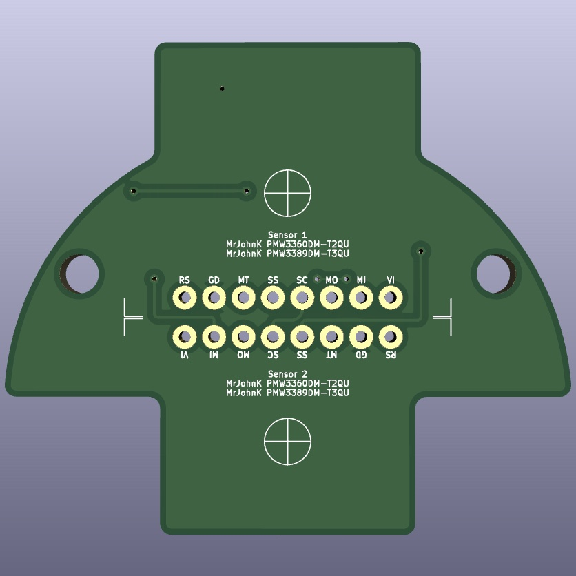

## Trackball Mezzanine PCBs

These are the mezzanine PCBs that connect the <a href="https://www.adafruit.com/product/4600">Adafruit QT Py</a> (SAMD21) MCU, <a href="https://github.com/mrjohnk/PMW3389DM">MrJohnK PMW3389</a> optical sensor breakout (<a href="https://www.tindie.com/products/jkicklighter/pmw3389-motion-sensor/">available on Tindie as of 2022</a>), simple components for the haptic feedback motor and pads for capacitive pickup wiring. This PCB allows for easy mounting inside the case for most components as well as a ground plane to help with the capacitive pickup interference. These are simple 2-layer PCBs that made with KiCad6 and includes a few custom footprints/symbols for the haptic motor. These can easily be fabricated through OSHPark, JLCPCB, etc. Original prototypes were fabricated by OSHPark and the gerber & hole files were exported from KiCad6 with OSHPark guidelines.

### Single Optical Sensor PCB

This mezzanine PCB supports a single optical sensor breakout and is good for a dedicated trackball or dedicated scrollball. This allows for a smaller case design, but made with using a 50mm or larger ball.

<table style="padding: 10px">
	<tr>
		<td width="33%"></td>
		<td width="33%"></td>
		<td width="33%"></td>
	</tr>
</table>

<table style="padding: 10px">
	<tr>
		<td width="33%"></td>
		<td width="33%"></td>
		<td width="33%"></td>
	</tr>
</table>

### Dual Optical Sensor PCB

*Currently work in progress*

This mezzanine PCB supports 2 optical sensor breakout boards being tested on a new case design. This leverages the PMW3389DM-T3QU or PMW3360DM-T2QU breakout boards from MrJohnK. Having the second optical sensor enables detecting horizontal ball movement (like a flat spin) to enable scroll/wheel events. This is specifically designed to work with the current case design detecting movements off a radial ball bearing for 1 sensor (scroll) and the trackball itself (x, y cursor movement).

<table style="padding: 10px">
	<tr>
		<td width="33%"></td>
		<td width="33%"></td>
		<td width="33%"></td>
	</tr>
</table>

## Credits, Attribution and Inspiration

* <a href="https://github.com/monroewilliams/trackball">MonroeWilliams' Trackball</a> project
* <a href="https://github.com/jfedor2">jfedor2's multiple trackball</a> projects